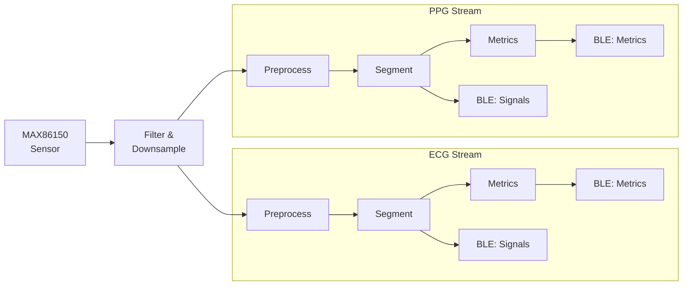
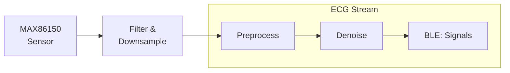

# Tileio Demos

This repository contains a collection of demos to demonstrate the capabilities of [Tileio](https://github.com/AmbiqAI/tileio) along with showcasing several of Ambiq's AI Development Kits (ADKs).

## Demo Zoo

| Name       | Target | Device Config  | Dashboard Config | FW |
| ---------- | ------ | -------------- | ----------------- | -- |
| HeartKit: ECG Segmentation | Apollo4 Blue | [device.json](./README.md) | [dashboard.json](./README.md) | [firmware.bin](./README.md) |
| HeartKit: ECG Denoise | Apollo4 Blue | [device.json](./README.md) | [dashboard.json](./README.md) | [firmware.bin](./README.md) |

## Demo Descriptions

### HeartKit: ECG Segmentation

This demo performs real-time ECG and PPG segmentation using HeartKit AI models along with PhysioKit framework. The diagram below shows the data flow from the sensor to the AI model and the results are streamed to the PhysioKit Pro app via BLE.

### HeartKit: ECG Denoise

This demo showcases real-time ECG denoising using AI. The data is collected from the MAX86150 sensor and processed using the HeartKit AI model.

### Air Quality Monitoring

This demo showcases real-time air quality monitoring using the Ambiq's Apollo3 Blue ADK. The data is collected from the BME680 sensor and processed using the AirKit AI model.
