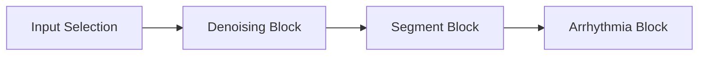

# HeartKit: ECG AI Heart Analysis

## Overview

This application performs real-time, on-device ECG analysis using a multi-headed AI model. The demo consists of the following blocks:

* **Input Selection**: Select between subject data or live sensor data.
* **ECG Denoising**: Clean the ECG signal using either DSP or enhanced AI denoising.
* **ECG Segmentation**: Delineate the QRS complex, P-wave, and T-wave to identify heart rate metrics using either DSP or AI segmentation.
* **ECG Arrhythmia Detection**: Perform 4-class arrhythmia detection using an AI model.

In addition to selecting the input stream, the user is also able to adjust a number of other parameters, such as injecting noise, selecting AI modes, and adjusting the hardware such as clock speed.



## Quick Setup

1. [Compile and flash EVB firmware](#compiling-and-flashing-firmware)
1. Launch Tileio App either using iOS/iPadOS app or [web app](https://ambiqai.github.io/tileio/)
1. Create new dashboard in Tileio and upload the [Tileio Configuration](./assets/hk-dashboard-config.json).
1. Connect the EVB either via USB or BLE to Tileio app.
1. Select the dashboard and connect to the EVB via BLE or USB.

## Supported Platforms

The following Ambiq EVBs are currently supported by neuralSPOT. Be sure to set the PLATFORM variable to the desired value.

* [__apollo4p_evb__](https://www.ambiq.top/en/apollo4-plus-soc-eval-board): Apollo4 Plus SoC, Eval Board
* [__apollo4p_blue_kxr_evb__](https://www.ambiq.top/en/apollo4-blue-plus-kxr-soc-eval-board): Apollo4 Blue Plus KXR SoC Eval Board
* [__apollo4l_blue_evb__](https://www.ambiq.top/en/apollo4-blue-lite-soc-eval-board): Apollo4 Blue Lite SoC, Eval board

## Compiling and Flashing Firmware

### Download repository and submodules

```bash
git clone --recurse-submodules https://github.com/AmbiqAI/tileio-demos.git
```

### Install toolchain and segger

* [Arm GNU Toolchain ^12.2](https://developer.arm.com/downloads/-/arm-gnu-toolchain-downloads)
* [Segger J-Link ^7.92](https://www.segger.com/downloads/jlink/)

### Building

Run the following command to build the firmware. Be sure to set the `PLATFORM` variable to the desired value.

```bash
make PLATFORM=apollo4p_blue_kxr clean
make PLATFORM=apollo4p_blue_kxr
```

### Flashing

To flash the firmware to the EVB, simply conntect the EVB to your computer using a USB-C cable and run the following command. Ensure USB-C cable is plugged into the J-Link USB port on the EVB.

```bash
make PLATFORM=apollo4p_blue_kxr deploy
```

### SWO Logging

To view SWO ouput, you can run the following command.

```bash
make PLATFORM=apollo4p_blue_kxr view
```

## Tileio Configuration

The application uses TileIO to communicate between the host and the device. The TileIO configuration is as follows:

* [**Tileio Configuration**](./assets/hk-dashboard-config.json)


### SLOT0: ECG

* name: ECG
* FS: 100 Hz
* Units: mV
* Channels:
  * CH0: Raw ECG signal
  * CH1: Denoised ECG signal
* Metrics:
  * 0- Heart rate
  * 1- Heart rate variability
  * 2- Denoise cosine similarity
  * 3- Arrhythmia classification
  * 4- Denoise inference per second
  * 5- Segmentation inference per second
  * 6- Arrhythmia inference per second
  * 7- CPU utilization

### I/O

* IO0: Input Select, Select, [Cycle, PT1: NSR, PT2: AFIB, PT3: AFL, PT4: BRADY, PT5: GSVT, Live]
* IO1: BW Noise Level, Slider, [0-100]
* IO2: MA Noise Level, Slider, [0-100]
* IO3: EM Noise Level, Slider, [0-100]
* IO4: Cpu Speed, Select, [96MHz, 192MHz]
* IO5: Denoise Mode, Select, [Off, DSP, AI]
* IO6: Segment Mode, Select, [Off, DSP, AI]
* IO7: Arrhythmia Mode, Select, [Off, DSP, AI]

## Assets

* [**Tileio Configuration**](./assets/hk-dashboard-config.json)
* [**ECG Denoising Model Configuration**](./assets/den-tcn-sm.json)
* [**ECG Segmentation Model Configuration**](./assets/seg-4-eff-sm.json)
* [**Arrhythmia Model Configuration**](./assets/arr-4-eff-sm.json)

## NS Version

commit: dbeb9f75
AS_VERSION="R4.4.1"
PLATFORM="apollo4p_blue_kxr_evb"
NESTEGG="rpc_client"

## Detailed Description

### Input Source

The demo can either be fed prior subject data or capture live sensor data via the MAX86150. The subjects included exhibit different heart rates, lead locations, and arrhythmia conditions to better demonstrate the AI models' capabilities.

### Denoising Block

__ECG denoising__ is the process of removing noise caused by several sources such as baseline wander (BW), muscle artifacts (MA), and electrode movement (EM). We can select between a light-weight DSP algorithm provided by PhysioKit or leverage an enhanced AI denoiser model.

### Segmentation Block

__ECG segmentation__ is the process of delineating key segments of the ECG signal, including the P-wave, QRS complex, and T-wave. These segments are used to compute a number of clinically relevant metrics, including heart rate, heart rate variability, QRS duration, and QT interval. They are also useful for a variety of downstream tasks such as heartbeat classification and arrhythmia detection.

### Arrhythmia Block

The __ECG arrhythmia__ block is used to detect several irregular heart rhythms including normal sinus, bradycardia, AFIB/AFL, and general supraventricular tachycardia.

### HRV Block

The __HRV block__ is used to identify heart rate as well several heart rate variability metrics. This block leverages the denoised ECG signal along with the segmentation mask.
