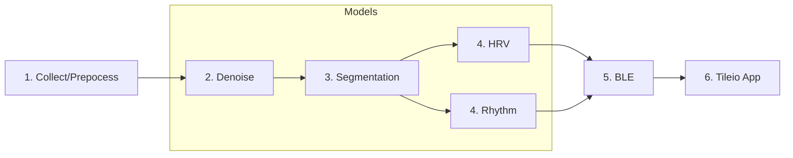
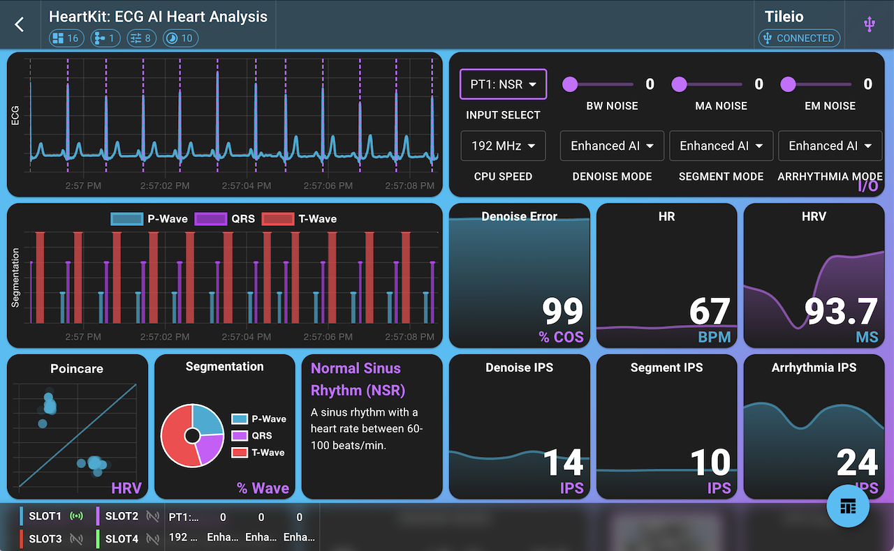
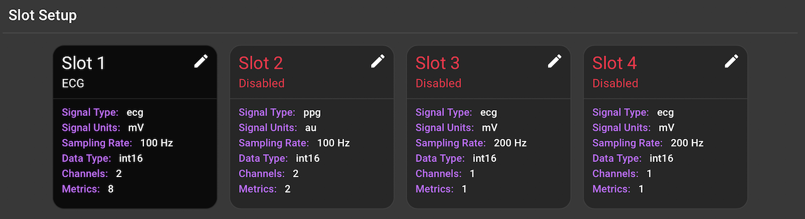
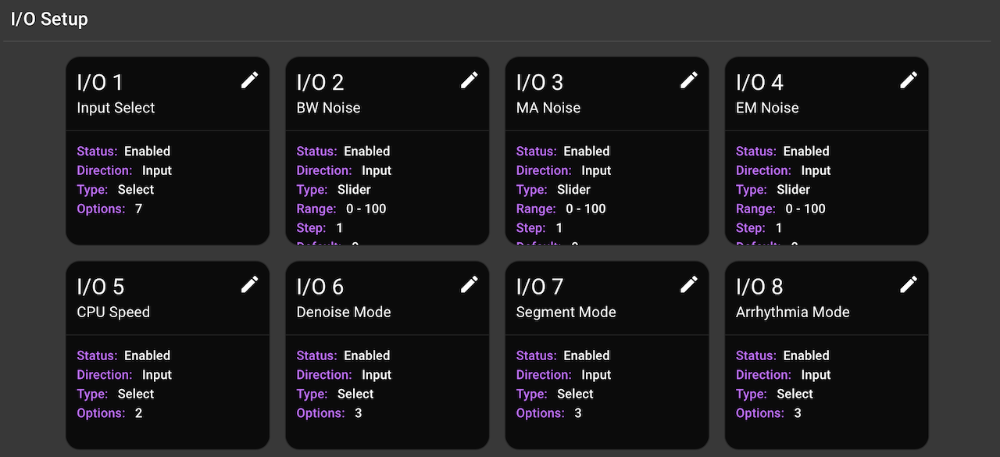

# HeartKit: ECG AI Heart Analysis

## Overview

This application performs real-time, on-device ECG analysis using a multi-headed AI model. The demo consists of the following blocks:

* **Input Selection**: Select between subject data or live sensor data.
* **ECG Denoising**: Clean the ECG signal using either DSP or enhanced AI denoising.
* **ECG Segmentation**: Delineate the QRS complex, P-wave, and T-wave to identify heart rate metrics using either DSP or an enhanced AI segmentation model.
* **ECG Arrhythmia Detection**: Perform 4-class arrhythmia detection using an enhanced AI model.

In addition to selecting the input stream, the user is also able to adjust a number of other parameters, such as injecting noise, selecting AI modes, and adjusting the hardware such as clock speed.



In the first stage, 2 seconds of sensor data is collected- either from stored subject data or directly from the MAX86150 sensor. In stage 2, the ECG data is denoised and in stage 3 is segmented. In stage 4, the cleaned, segmented data is fed into the upstream blocks to compute HRV metrics along with arrhythmia detection using 10 seconds of data. Finally, in stage 5, the ECG data and metrics are streamed over BLE/USB to Tileio App to be displayed in a dashboard.

## Architecture

The HeartKit demo leverages a multi-head network- a backbone denoising and segmentation model followed by 2 upstream heads:

* [__Denoising model__](./assets/den-tcn-sm.json) utilizes a small 1-D TCN architecture to remove noise from the ECG signal.
* [__Segmentation model__](./assets/seg-4-tcn-sm.json) utilizes a small 1-D TCN architecture to perform ECG segmentation.
* [__Rhythm head__](./assets/arr-4-eff-sm.json) utilizes a 1-D MBConv CNN to detect 4-class arrhythmias.
* __HRV head__ utilizes segmentation results to derive a number of useful metrics including heart rate and heart rate variability (HRV).

## Demo Setup

### Contents

* [Ambiq Apollo4 EVB Platform](#supported-platforms)
* [MAX86150 ECG/PPG Sensor](https://protocentral.com/product/protocentral-max86150-ppg-and-ecg-breakout-with-qwiic-v2/?cgkit_search_word=max86150)
* iPad or tablet/PC with Chrome/Edge browser
* 2x USB-C cables
* 1x Qwiic cable
* 1x USB-C battery pack for EVB (optional)

### Supported Platforms

The following Ambiq EVBs are currently supported by the demo. Be sure to set the __PLATFORM__ variable to the desired value.

* **apollo4p_evb** - [Apollo4 Plus SoC, Eval Board](https://www.ambiq.top/en/apollo4-plus-soc-eval-board):
* **apollo4p_blue_kxr_evb** - [Apollo4 Blue Plus KXR SoC Eval Board](https://www.ambiq.top/en/apollo4-blue-plus-kxr-soc-eval-board):
* **apollo4l_blue_evb** - [Apollo4 Blue Lite SoC, Eval board](https://www.ambiq.top/en/apollo4-blue-lite-soc-eval-board):

## Starting from Scratch

Before we can run the demo, the following steps need to be performed:

1. [Compile and flash EVB firmware](#1-compile-and-flash-evb-firmware)
2. [Setup Tileio Dashboard](#2-setup-tileio-dashboard)

### 1. Compile and Flash EVB Firmware

### [OPTION 1] Load existing firmware with J-Link

This option is recommended for users who want to quickly load the existing firmware without compiling the code. The only required tool is the J-Link software, which can be downloaded from the [SEGGER website](https://www.segger.com/downloads/jlink/). The J-Link software includes the JFlashLite tool, which is used to flash the firmware to the EVB.

The firmware binary can be found in the `assets/bin` directory. The firmware binary is named `$PLATFORM.bin` where `$PLATFORM` is the platform name. For example, the firmware binary for the `apollo4p_blue_kxr` platform is `apollo4p_blue_kxr.bin`. Follow the instructions below to flash the firmware to the EVB.

1. Download the firmware binary from the `bin` directory.
1. Connect the EVB to your computer using a USB-C cable.
1. Launch JFlashLite tool
1. Select the following options and press `OK`:
     * **Target Device**: `AMAP42KK-KBR`
     * **Target Interface**: `SWD`
     * **Speed**: `4000 kHz`
1. Select **Data File** and browse for the downloaded firmware binary.
1. Set **Prog. Addre** to `0x18000`.
1. Click `Program Device` to flash the firmware to the EVB.

### [OPTION 2] Compile and flash latest firmware

Please refer to the top-level [README](../README.md) for detailed instructions on how to clone and install the necessary tools. Once the tools are installed, follow the instructions below to compile and flash the firmware to the EVB.

Run the following command to compile the firmware. Be sure to set the `PLATFORM` variable to the desired value from list above.

```bash
make PLATFORM=apollo4p_blue_kxr clean
make PLATFORM=apollo4p_blue_kxr
```

To flash the firmware to the EVB, simply connect the EVB to your computer using a USB-C cable and run the following command. Ensure USB-C cable is plugged into the J-Link USB port on the EVB.

```bash
make PLATFORM=apollo4p_blue_kxr deploy
```

### 2. Setup Tileio Dashboard

Launch the Tileio App using either the iOS/iPadOS app or the [web app](https://ambiqai.github.io/tileio/). The first time you launch the app, you will need to create a new dashboard and either select the respective built-in dashboard or upload the latest [Tileio dashboard configuration file](#assets).

## Running the Demo

Once the EVB is flashed and the Tileio app is configured, you can now connect the EVB to the Tileio app. Connect the EVB either via USB or BLE to the Tileio app. Select the dashboard and connect to the EVB via BLE or USB. Please refer to [Tileio Documentation](https://ambiqai.github.io/tileio-docs/) to learn more about the Tileio App. Once connected, real-time data will be displayed on the dashboard.

## Dashboard Overview

The dashboard is layed out in 4 rows as shown below.



The first row consists of two tiles: (1) the ECG signal and (2) the I/O controls tile. The I/O controls tile allows the user to select the input source, adjust noise levels, and select the AI modes. The input source consists of 5 subject's pre-recorded ECG data containing different arrhythmia conditions. In addition, the user can select live sensor data from the connected MAX86150 sensor. There are three noise levels that can be adjusted: baseline wander (BW), muscle artifacts (MA), and electrode movement (EM). These are controlled via the three sliders from 0% to 100%. The I/O tile also allows the user to select the AI modes for denoising, segmentation, and arrhythmia detection. The choices include *Off*, *PhsyioKit*, and *enhanced AI*. The *PhysioKit* option provides open-source, reference algorithms for the three blocks. The *enhanced AI* option provides a more advanced AI model for denoising, segmentation, and arrhythmia detection that were generated using Ambiq's HeartKit ADK.

The second row consists of the segmented ECG signal tile, denoise error tile, followed by the heart rate (HR) and heart rate variability (HRV) tiles. The segmented ECG signal tile displays the ECG signal with the QRS complex, P-wave, and T-wave segments highlighted. When *PhysioKit* is selected only QRS complexes are highlighted. The denoise error tile displays the cosine similarity between the raw and denoised ECG signals. The HR tile displays the heart rate in beats per minute (BPM) and the HRV tile displays the heart rate variability metrics.

The third row consists of the HRV poincare plot tile, arrhythmia label tile, segmentation pie chart tile, followed by inferences per second tiles for denoising, segmentation, and arrhythmia detection blocks. The HRV poincare plot tile plots the time delta between successive heart beats in a scatter plot. The segmentation pie chart tile displays the percentage of time spent in each segment of the ECG signal. The arrhythmia label tile displays the detected arrhythmia class. The inferences per second tiles display the number of inferences per second for denoising, segmentation, and arrhythmia detection.

The fourth and final row consists of demo description tile, model complexity slides tile, HeartKit QR code tile, and lastly the CPU utilization tile. The model complexity slides tile displays the number of parameters, FLOPs, accuracy, inference time, inference power, and inferences per second per watt efficiency metrics for the denoising, segmentation, and arrhythmia detection models. The CPU utilization tile displays a course-grained view of the CPU utilization.

## Assets

* [**Tileio Configuration**](./assets/hk-dashboard-config.json)
* [**ECG Denoising Model Configuration**](./assets/den-tcn-sm.json)
* [**ECG Segmentation Model Configuration**](./assets/seg-4-eff-sm.json)
* [**Arrhythmia Model Configuration**](./assets/arr-4-eff-sm.json)
* [**apollo4p_blue_kxr_evb firmware**](./assets/bin/apollo4p_blue_kxr_evb.bin)

## Tileio Configuration

The application uses Tileio to communicate between the host and the device. The Tileio configuration is as follows:

### Slots

A single slot is used for the application. The slot is configured with the following parameters:



### I/O

The demo leverages all eight I/O channels. The I/O configuration is as follows:


