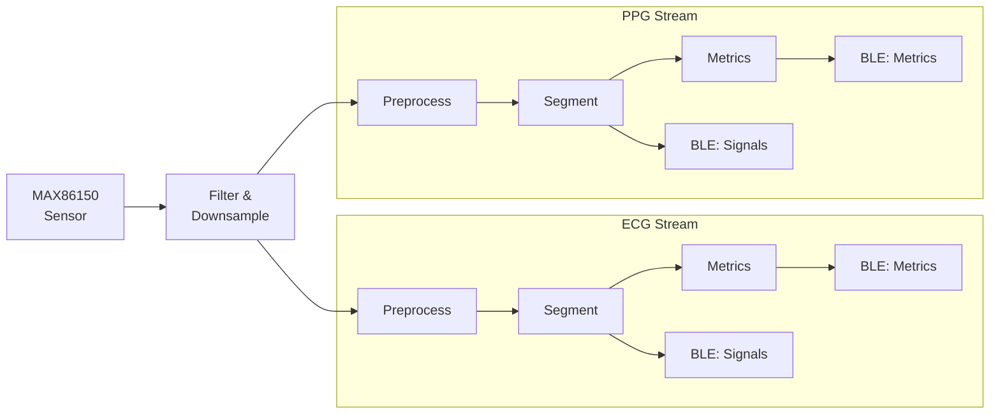

# HeartKit:ECG AI Heart Analysis

This demo performs real-time ECG and PPG segmentation using HeartKit AI models along with PhysioKit framework. The diagram below shows the data flow from the sensor to the AI model and the results are streamed to the PhysioKit Pro app via BLE.

## Downloads

- [**Device Configuration**](../assets/device-configs/hk-device-config.json)
- [**Dashboard Configuration**](../assets/dashboard-configs/hk-dashboard-config.json)
