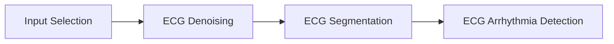

# HeartKit:ECG AI Heart Analysis

This application performs real-time, on-device ECG analysis using a multi-headed AI model. The demo consists of four stages:

* **Input Selection**: Select between subject data or live sensor data.
* **ECG Denoising**: Clean the ECG signal using either DSP or enhanced AI denoising.
* **ECG Segmentation**: Delineate the QRS complex, P-wave, and T-wave to identify heart rate metrics using either DSP or AI segmentation.
* **ECG Arrhythmia Detection**: Perform 4-class arrhythmia detection using an AI model.

In addition to selecting the user input, the end user is also able to adjust a number of other parameters, such as injecting noise, selecting denoising and segmentation modes, and adjusting the hardware such as clock speed.

## Tileio Configuration Overview

The application uses TileIO to communicate between the host and the device. The TileIO configuration is as follows:

### SLOT0: ECG

* name: ECG
* FS: 100 Hz
* Units: mV
* Channels:
  * CH0: Raw ECG signal
  * CH1: Denoised ECG signal
* Metrics:
  * 0- Heart rate
  * 1- Heart rate variability
  * 2- Denoise cosine similarity
  * 3- Arrhythmia classification
  * 4- Denoise inference per second
  * 5- Segmentation inference per second
  * 6- Arrhythmia inference per second
  * 7- CPU utilization
  *

SLOT0: ECG
CH0: RAW
CH1: DENOISED

### I/O

IO0: Input Select, select, options: PT 1: NSR, PT 2: AFIB, PT 3: GSVT, PT 4: BRADY, PT 5: AFL, Live
IO1: Noise Level, slider, min: 0, max: 100
IO2: Denoise Mode, select, options: OFF, DSP, Enhanced AI
IO3: Segmentation Mode, select, options: Pan Tompkins, AI Segmentation
IO4: CPU Speed, select, options: 96 MHz, 192 MHz
IO5:
IO6:
IO7: Leds 0-7

## Downloads

The following files are available for download:

* [**Tileio Configuration**](./assets/hk-dashboard-config.json)
