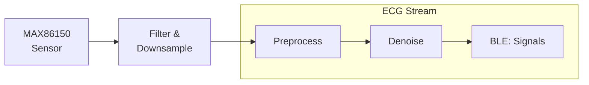

# HeartKit: ECG Denoising

This demo showcases real-time ECG denoising using AI. The data is collected from the MAX86150 sensor and processed using the HeartKit AI model.

```mermaid
flowchart LR
    COLL[MAX86150 \nSensor] --> PRE[Filter &\nDownsample]
    PRE --> ECG_COL[Preprocess]

    subgraph ECG Stream
    ECG_COL --> ECG_DENOISE[Denoise]
    ECG_DENOISE --> ECG_BLE_SLOT[BLE: Signals]
    end
```
