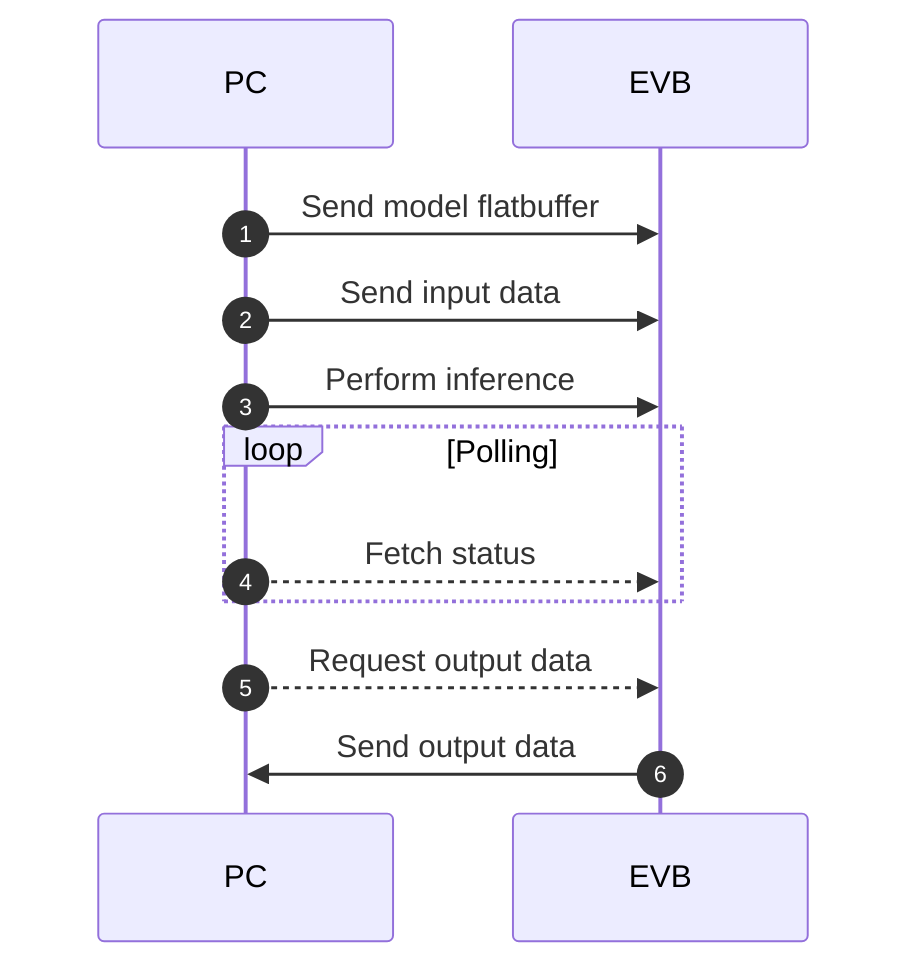

# TFLM Inference Engine

## Overview

This demo configures the EVB to run as a TFLM inference engine that serves requests over USB using RPC. A client is able to connect and perform the following actions:

* Send model as TFLM flatbuffer
* Send input data
* Perform inference
* Fetch output data

This inference engine is leveraged by both HeartKit and SleepKit to run demos when backend is set to "EVB".

_NOTE_: The inference engine registers all available TFLM operations and allocates a large amount of memory for TFLM tensor arena and model flatbuffer to accomadate any model. This is not ideal for profiling power / memory. To get better power / memory analysis, please use neuralSPOT's AutoDeploy tool.

### High Level Sequence Diagram



### Supported Platforms

The following Ambiq EVBs are currently supported by neuralSPOT. Be sure to set the PLATFORM variable to the desired value.

* [__apollo4p_evb__](https://www.ambiq.top/en/apollo4-plus-soc-eval-board): Apollo4 Plus SoC, Eval Board
* [__apollo4p_blue_kbr_evb__](https://www.ambiq.top/en/apollo4-blue-plus-kxr-soc-eval-board): Apollo4 Blue Plus KBR SoC Eval Board
* [__apollo4p_blue_kxr_evb__](https://www.ambiq.top/en/apollo4-blue-plus-kxr-soc-eval-board): Apollo4 Blue Plus KXR SoC Eval Board
* [__apollo4l_evb__](https://www.ambiq.top/en/apollo4-lite-soc-eval-board): Apollo4 Lite SoC, Eval board
* [__apollo4l_blue_evb__](https://www.ambiq.top/en/apollo4-blue-lite-soc-eval-board): Apollo4 Blue Lite SoC, Eval board

## Prerequisites

### Download repository and submodules

```bash
git clone --recurse-submodules https://github.com/AmbiqAI/tileio-demos.git
```

### Install toolchain and segger

* [Arm GNU Toolchain ^12.2](https://developer.arm.com/downloads/-/arm-gnu-toolchain-downloads)
* [Segger J-Link ^7.92](https://www.segger.com/downloads/jlink/)

Note: You can optionally use `armclang` instead. The makefile can be configured by providing `TOOLCHAIN=arm` in make commands.

## Building

Run the following command to build the firmware. Be sure to set the `PLATFORM` variable to the desired value.

```bash
make PLATFORM=apollo4p_evb clean
make PLATFORM=apollo4p_evb
```

## Flashing

To flash the firmware to the EVB, simply conntect the EVB to your computer using a USB-C cable and run the following command. Ensure USB-C cable is plugged into the J-Link USB port on the EVB.

```bash
make PLATFORM=apollo4p_evb deploy
```

### SWO Logging

To view SWO ouput, you can run the following command.

```bash
make PLATFORM=apollo4p_evb view
```
